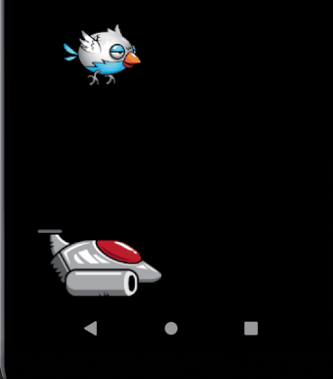

# Flutter Flame Sprite Test

## Collision Detection of Animated Sprites

* Sprite on the left is a static sprite.
* The two sprites on the right are using SpriteAnimationComponent.


```dart
Future<void> onLoad() async {
  ...
    var flappySheet = await images.load('blue_bird_sheet.png');
    final flappySpriteSize = Vector2(100.0, 79.0);
    SpriteAnimationData flappySpriteData = SpriteAnimationData.sequenced(
        amount: 6, stepTime: 0.2, textureSize: Vector2(100, 79));
    flappyBird.size = flappySpriteSize;
    flappyBird.animation =
        SpriteAnimation.fromFrameData(flappySheet, flappySpriteData);
    add(flappyBird);
```

## Animated Sprite

The animation below was created in the `onLoad` method.


## load and display sprite

* sprite is loaded from image file with `loadSprite('imageFileName')`
* SpriteComponent is instantiated above onLoad to make it accessible in update


```dart
class BirdGame extends BaseGame {
  Bird bird = Bird();
  @override
  Future<void> onLoad() async {
    var birdSprite = await loadSprite('bird.png');
    // pass sprite and screensize
    add(bird
      ..screensize = size
      ..sprite = birdSprite);
  }
  ```

## collision detection and remove



The `bird` and `ship` sprites are instantiated in the main game class.

```dart
  @override
  void update(double dt) {
    super.update(dt);
    if (bird.toRect().contains(ship.toRect().center)) {
      print('bird collided with ship and is dead ');
      remove(bird);
    }
  }
```

## animation from spritesheet


```dart
final spriteSize = Vector2(100.0, 88.0);
SpriteAnimationData spriteData = SpriteAnimationData.sequenced(
    amount: 2, stepTime: 0.3, textureSize: Vector2(100, 88));
final yellowFlappingAnimation = SpriteAnimationComponent.fromFrameData(
    spriteSize, spriteSheet, spriteData)
    ..x = 100
    ..y = 350;
add(yellowFlappingAnimation);
```

## Notes


For the whole frames you can just create a list with the elements in it like so:

```dart
final frames = <SpriteAnimationFrameData>[
  SpriteAnimationFrameData(srcPosition: Vector2(0,0), srcSize: Vector2(16,36), stepTime: 0.2),
  SpriteAnimationFrameData(srcPosition: Vector2(16,0), srcSize: Vector2(16,36), stepTime: 0.2),
  SpriteAnimationFrameData(srcPosition: Vector2(32,0), srcSize: Vector2(16,36), stepTime: 0.2),
  ...
  ...
];
```

To move the instance out of the GameWidget you can do:
```
void main() {
  final myRealGame = MyRealGame();
  runApp(
    GameWidget(
      game: myRealGame,
    ),
  );
}
```

Sprite and text transparency
Try setting a custom Paint in SpriteComponent to `this.overridePaint = myPaint;`

## Version

* Using flame: ^1.0.0-rc6 as of 1/24/2021